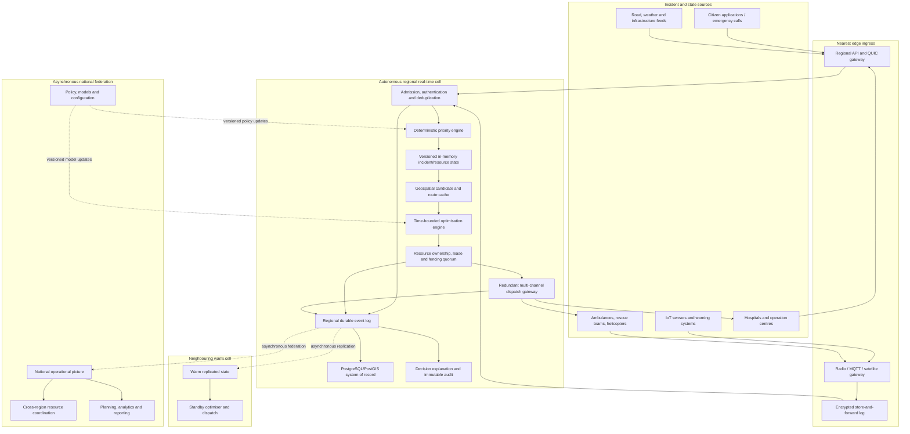
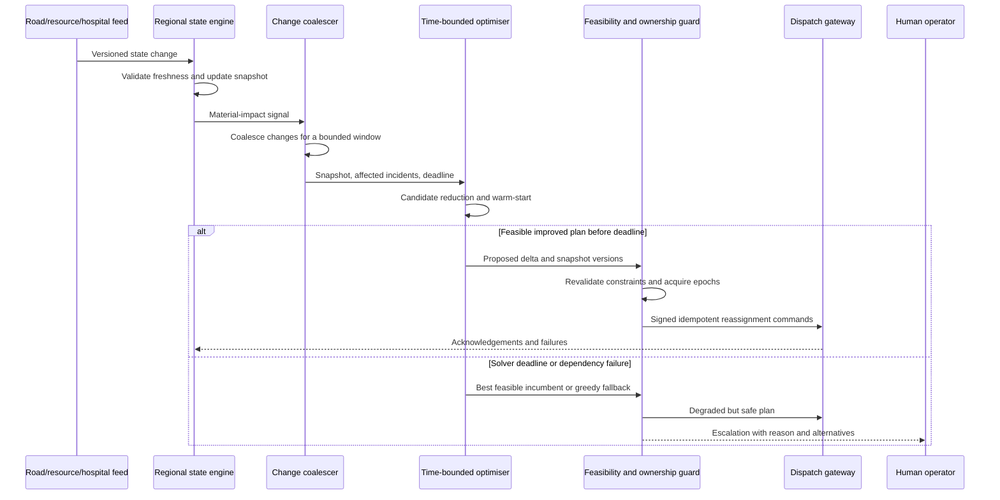

# Emergency Response and Resource Optimisation Platform: Low-Latency, Highly Available Backend Design

> Repository note (reviewed 5 August 2026): this is retained as research input, not as proof of the current implementation. The verified code-to-roadmap reconciliation is maintained in [docs/redesign-reconciliation.md](docs/redesign-reconciliation.md). Non-portable research citation tokens in this file must not be copied into the competition PDF.

## Executive summary

The PDF asks for a country-wide backend that continuously ingests emergency incidents, prioritises them, assigns ambulances, hospitals, rescue teams, helicopters and emergency-operation centres, and re-optimises assignments as roads, capacity, communications and resource availability change. It explicitly requires near-real-time, explainable and operationally feasible decisions under very high throughput, while remaining scalable, reliable, fault tolerant and maintainable. fileciteturn0file0

The recommended design is a **cell-based, edge-first architecture**. Each geographical region operates an autonomous real-time decision cell containing local ingress, an in-memory resource index, a deterministic prioritiser, a time-bounded optimiser, an authoritative resource-ownership service and redundant dispatch gateways. A national layer receives asynchronous replicated state, supports cross-region coordination and policy management, but is deliberately kept off the normal local dispatch path. This prevents national WAN latency or a central outage from delaying a life-critical local decision.

The design should distinguish two meanings of “real time”:

* Inside a controlled operations centre, hospital campus or vehicle depot, bounded execution can be engineered with an RTOS or Linux `PREEMPT_RT`, CPU isolation, fixed-priority scheduling, short interrupt handlers, TSN-capable Ethernet and tightly bounded queues. Linux `PREEMPT_RT` makes most kernel execution pre-emptible, replaces relevant locks with priority-inheritance-aware mechanisms and threads most interrupts; QNX and VxWorks provide purpose-built fixed-priority real-time environments. citeturn0search0turn0search4turn0search9turn8search1
* Across a country-wide public or carrier WAN, a strict deterministic upper bound cannot normally be guaranteed because propagation, congestion, rerouting, radio conditions and third-party failures are outside the application’s control. The appropriate contract is therefore a stringent percentile-based SLO, combined with autonomous regional operation and store-and-forward edge behaviour.

A practical reference target is a **first feasible dispatch decision within 100 ms at regional p99**, a **resource-command acknowledgement within 250 ms at p99** when the responder is connected, and continued regional operation despite loss of the national control plane. These are proposed engineering objectives rather than numbers stated in the PDF. The optimiser must be time-boxed: it should return the best feasible answer found before the deadline rather than wait indefinitely for mathematical optimality.

The recommended technology stack is:

| Layer | Recommended baseline |
|---|---|
| Embedded and safety-critical edge | QNX or VxWorks where certification and hard-real-time behaviour justify commercial RTOS licensing; Zephyr for small MCU gateways |
| Regional real-time compute | Bare-metal or carefully isolated Linux with `PREEMPT_RT`; Rust or C++ services; dedicated CPU cores and NUMA-aware allocation |
| Real-time local messaging | DDS/RTPS with explicitly configured QoS; TSN where the LAN is controlled |
| WAN and mobile transport | QUIC with TLS for path migration and low-latency connection establishment; MQTT for constrained devices where brokered delivery is acceptable |
| Durable event backbone | Apache Kafka with idempotent producers, regional replication and partitioning by incident or resource ownership |
| Authoritative state | PostgreSQL/PostGIS for durable relational and geospatial data; etcd/Raft for small, strongly consistent ownership, lease and fencing state |
| Hot state and candidate index | Process-local immutable snapshots plus an optional Redis-derived cache; never make a remote cache mandatory for the emergency dispatch loop |
| Optimisation | Candidate reduction followed by min-cost flow or assignment; CP-SAT/MIP for complex constraints; deterministic greedy fallback |
| Observability | OpenTelemetry traces, metrics and logs; Prometheus-compatible time series; synthetic correctness and dispatch probes |
| Security | Workload identity, mutual TLS, signed commands, least privilege, hardware-backed keys, immutable audit trails and explicit zero-trust policies |

This stack intentionally uses **different mechanisms for different timing domains**. Kafka, PostgreSQL and Kubernetes are valuable for durability, integration and management, but a Kafka commit, a remote SQL transaction or a Kubernetes scheduling action should not be a prerequisite for the first local emergency response. Kafka’s durable, idempotent and transactional facilities are valuable for event processing, but durability settings trade latency against acknowledgement strength. citeturn2search8turn2search13turn2search19

## Extracted PDF question and required work

The core question on page one is:

> **“Intelligent Emergency Response & Resource Optimization Platform”**
>
> “Design a backend system capable of managing and optimizing emergency response operations for a large-scale country-wide disaster management network.
>
> The platform must continuously receive emergency incidents from multiple regions while coordinating available emergency resources such as ambulances, hospitals, rescue teams, helicopters, and emergency operation centers.
>
> Each emergency incident has its own characteristics, including but not limited to:
>
> Geographic location; Severity level; Number of affected people; Time sensitivity; Resource requirements; Environmental condition.
>
> Resources also have dynamic properties, such as:
>
> Current location; Availability; Capacity; Estimated travel time; Operational constraints; Temporary failures or maintenance.
>
> During execution, the environment is expected to change continuously. New emergency requests may arrive at any moment, roads may become unavailable, hospitals may reach full capacity, vehicles may fail, communication delays may occur, and resource availability may change unexpectedly.
>
> Your proposed system should continuously make near-optimal, explainable, and operationally feasible decisions while adapting to these changing conditions in near real time.
>
> The system should be designed for very high throughput and should remain reliable, scalable, fault tolerant, and maintainable under heavy load.”

Page two states that the architecture and decision engine must:

> “Accept and process a continuous stream of emergency events.
>
> Prioritize incidents intelligently.
>
> Allocate the most appropriate resources.
>
> Continuously re-optimize decisions whenever the environment changes.
>
> Minimize overall response time.
>
> Maximize resource utilization.
>
> Prevent resource conflicts.
>
> Remain operational even when parts of the system become unavailable.
>
> Scale efficiently as the number of users, incidents, and resources increases.”

It also requires explanation of the overall architecture, data flow, service interactions, decision-making strategy, optimisation approach, failure recovery, scalability, performance, security, monitoring, database design, caching and event processing, with justification for every important architectural decision. fileciteturn0file0

The PDF therefore asks for more than a scheduling algorithm. It requires an integrated distributed system whose decisions remain valid while the input state is changing. The submission must solve four related problems:

| Problem | What must be demonstrated |
|---|---|
| Continuous situational awareness | Ingest incidents, telemetry, hospital capacity, road closures, weather and equipment failures without central bottlenecks |
| Fast and safe decision-making | Rank urgency, find feasible candidates, minimise expected harm and response time, and explain why each assignment was made |
| Concurrency correctness | Ensure that one ambulance, bed, team or helicopter is not committed to incompatible incidents at the same time |
| Operational resilience | Continue dispatching under node, link, zone, database, broker and national-control-plane failures |

A strong solution should explicitly state assumptions absent from the PDF. In particular, it should define anticipated event rates, number of resources, number of regions, latency objectives, required recovery point and recovery time, network conditions, safety classification and the authority model for human overrides. Without those quantities, “high throughput”, “near real time” and “high availability” are not objectively testable.

It should also define **explainability as a first-class output**, not a dashboard added after optimisation. Every decision record should contain the incident priority factors, candidates considered, candidates rejected with constraint reasons, estimated travel and mobilisation times, capacity consumed, policy version, state versions used, solver mode, objective components, confidence and any human override.

## Engineering objectives, latency budgets and safety invariants

The following targets provide a defensible starting point for benchmarking. They are proposed targets and should be revised against actual geography, carrier latency, emergency-service procedures and hardware.

| Service-level indicator | Proposed objective | Reason |
|---|---:|---|
| P0 incident accepted by nearest healthy regional cell | p99 ≤ 20 ms | Admission must not wait for optimisation or cross-region replication |
| Incident validated and prioritised | p99 ≤ 5 ms after admission | Rule evaluation should be deterministic and memory-resident |
| First feasible resource plan | p99 ≤ 100 ms regional; p99.9 ≤ 250 ms | Fast response is more important than proving global optimality |
| Dispatch command emitted | p99 ≤ 20 ms after plan commitment | Keep the dispatch path local |
| Connected responder acknowledgement | p99 ≤ 250 ms regional | Detect delivery failure quickly and activate alternate channels |
| Re-optimisation after material state change | p99 ≤ 500 ms | Avoid thrashing on minor telemetry while reacting quickly to closures and failures |
| Critical regional dispatch availability | ≥ 99.999% measured per region | Roughly five minutes of annual error budget if evenly distributed |
| Regional recovery point | Zero acknowledged assignment loss within the regional quorum | Prevent duplicate or forgotten commitments |
| Cross-region recovery point | Target ≤ 5 seconds | Asynchronous national replication avoids WAN consensus in the hot path |
| Regional failover time | Target ≤ 5 seconds for an individual cell leader; ≤ 60 seconds for site evacuation | Separates software failover from full-facility failover |
| Decision audit completeness | 100% of committed decisions | Required for investigation, governance and operator trust |

SLOs should use user-visible indicators rather than only host health. Google’s SRE guidance defines the error budget as one minus the SLO and recommends measuring objectives at meaningful service boundaries; the same model can govern release velocity and reliability work for this platform. citeturn3search12turn3search13

A representative 100 ms regional decision budget is:

| Stage | Budget |
|---|---:|
| Network receipt and authentication | 10 ms |
| Schema validation and deduplication | 3 ms |
| Incident classification and priority computation | 2 ms |
| Geospatial and capability candidate lookup | 10 ms |
| ETA and route-feature lookup | 20 ms |
| Optimisation | 35 ms |
| Ownership/lease commit | 10 ms |
| Command construction and local publication | 10 ms |

This is a budget, not a prediction. Every stage must propagate the remaining deadline. A component receiving only 8 ms of remaining budget must not begin an operation whose normal timeout is 50 ms.

**Safety and correctness invariants** should take precedence over average throughput:

| Invariant | Enforcement |
|---|---|
| A resource cannot have two concurrent exclusive assignments | Versioned compare-and-set plus quorum-backed lease and fencing token |
| An expired or superseded controller cannot issue a valid command | Monotonically increasing resource epoch included in every signed command |
| Replayed incidents or commands cannot create duplicate effects | Globally unique idempotency key, source sequence and durable deduplication record |
| A plan must satisfy hard constraints before dispatch | Separate hard-feasibility validation after the optimiser returns |
| A response must exist even when the advanced optimiser fails | Deterministic greedy fallback and operator escalation |
| State uncertainty must not be hidden | Freshness and confidence attached to location, capacity, ETA and availability |
| Manual override must not erase machine reasoning | Append a new override event; never mutate historical decisions |
| Lower-priority load cannot starve P0 work | Admission control, separate queues and reserved compute/network capacity |

The platform should avoid calling the entire country-wide system “hard real time”. A more accurate assurance case is: **hard or firm real-time behaviour within selected local control loops; highly reliable, measured soft-real-time behaviour across regional and national networks**. IEEE TSN is intended to provide bounded low latency, low delay variation and low packet loss on engineered IEEE 802 networks, while 802.1Qbv schedules frame transmission using synchronised time from 802.1AS. These properties apply to controlled TSN domains, not arbitrary end-to-end internet paths. citeturn1search4turn1search6turn1search8turn1search13

## Reference architecture and end-to-end data flow

The architecture uses multiple independently operable **regional cells**. Each cell owns a set of resource shards and can receive incidents for its area. Neighbouring cells maintain warm read replicas and can take over ownership through a controlled epoch change. National services aggregate and coordinate but do not sit between a local incident and a local ambulance.



**Critical path.** On receipt, the ingress verifies source identity, enforces payload limits, assigns or validates an idempotency key, appends to a local write-ahead buffer and acknowledges admission. The prioritiser calculates an initial incident class from severity, affected population, time sensitivity, vulnerability, hazard escalation and data confidence. Candidate lookup then excludes incompatible resources using capability, status, jurisdiction, capacity, operating limits and estimated reachability. The optimiser chooses a feasible plan, and the ownership service atomically acquires the selected resources using current versions and fencing epochs. Only then does dispatch issue signed commands.

**Durability path.** Admission, state changes, proposals, commitments, acknowledgements and operator actions are published to a regional event log. Kafka separates producers and consumers and stores events in partitioned topics; its idempotent and transactional producer facilities can suppress retry-created duplicates and atomically publish related output records. Those guarantees are particularly useful for audit projections and state materialisation, although external side effects such as radio transmissions still require application-level idempotency. citeturn2search8turn2search19turn2search20

**Database design.** PostgreSQL/PostGIS is appropriate for durable incidents, resources, facilities, capabilities, jurisdiction boundaries, route restrictions, policies, decision explanations and audit references. PostGIS provides spatial types, spatial processing and GiST-based R-tree indexes, allowing geospatial data to remain transactionally associated with ordinary relational data. citeturn10search3turn10search7

Suggested core records are:

| Record | Important fields |
|---|---|
| `Incident` | ID, source, idempotency key, geometry, severity, people affected, deadline, required capabilities, hazard, status, state version |
| `Resource` | ID, type, capabilities, capacity, current geometry, availability, health, home region, owner epoch, state version |
| `FacilityCapacity` | Facility, capability or bed type, available count, reserved count, freshness, source |
| `Assignment` | Incident, resource, role, planned ETA, lease, fencing epoch, committed state, command ID |
| `Decision` | Policy version, input snapshot revisions, candidates, rejected constraints, objective values, solver mode, runtime |
| `Command` | Assignment, recipient, channel, sequence, deadline, signature, acknowledgement |
| `Event` | Aggregate key, source sequence, event type, payload hash, timestamp, trace ID |

The regional optimiser should not query PostgreSQL for every candidate. It should consume event-log updates into an immutable process-local snapshot containing spatial cells, resource capabilities and current ownership. The database remains authoritative for recovery and history, while the snapshot serves reads on the hot path.

**Re-optimisation flow** should be event driven and coalesced:



Re-optimisation must avoid destabilising responders. A reassignment should occur only when the expected improvement exceeds a configurable switching penalty and when the existing resource has not passed a “commitment horizon”, such as patient contact, aircraft take-off or a route segment where reversal would be unsafe. This is an operational constraint, not merely an optimisation cost.

## Low-latency mechanisms and technology selection

**Operating-system choices**

| Option | Deterministic mechanisms | Strengths | Limitations | Recommended role |
|---|---|---|---|---|
| Linux with `PREEMPT_RT` | Pre-emptible kernel paths, priority-inheritance-aware `rtmutex`, threaded interrupts, fixed-priority policies | Broad hardware, networking, observability and developer ecosystem | Worst-case bound must be established on the exact hardware and configuration; background kernel and firmware effects require control | Regional optimiser, ingest and dispatch nodes |
| QNX Neutrino | Fixed-priority scheduling, message-driven priority inheritance, fully pre-emptible microkernel, process isolation | Strong real-time model and fault isolation; suitable for mission-critical edge systems | Commercial licensing; smaller general-purpose ecosystem | Operation-centre appliances, vehicle gateways and safety-related edge |
| VxWorks | Deterministic priority-based pre-emption, TSN support and safety-certification options | Mature embedded and certified deployments | Commercial toolchain and integration cost | Certified vehicle, aviation or industrial emergency equipment |
| Zephyr | Direct and zero-latency interrupt support; small embedded footprint | Open source, suitable for MCU-class gateways and sensors | Not intended to host the national or regional optimisation stack | Sensor gateways and simple local fail-safe controllers |

Linux `PREEMPT_RT` reduces scheduling latency by moving most kernel execution under scheduler control, threading interrupts and using priority-inheritance-aware locking. QNX schedules the highest-priority ready thread and propagates client priority through message passing; its current documentation describes very short non-pre-emptible intervals in the microkernel. Zephyr provides direct “zero-latency” interrupts for carefully constrained handlers and a cyclic-test-style facility for measuring worst observed interrupt-to-thread latency. citeturn0search3turn0search4turn0search5turn0search9turn0search12turn0search13

**CPU and scheduler configuration.** For regional hot-path nodes:

* Reserve physical cores for ingress, prioritisation, state application, optimisation and dispatch. Pin each real-time thread and its memory to the same NUMA node.
* Use `SCHED_FIFO` or an equivalent fixed-priority policy only for bounded, reviewed code. Assign the shortest, most critical activities the highest priority, and ensure every thread blocks or yields predictably.
* Route emergency NIC receive queues to dedicated cores. Move unrelated IRQs, housekeeping, logging, storage and orchestration agents elsewhere.
* Disable deep power-saving states and dynamic frequency behaviour where latency testing shows unacceptable jitter; lock memory to prevent page faults; pre-fault stacks and buffers.
* Preallocate request objects, route matrices and solver workspaces. Avoid heap allocation, DNS lookup, certificate retrieval and class loading after the process becomes ready.
* Keep interrupt handlers minimal: timestamp, acknowledge hardware, enqueue a compact descriptor and wake the correct thread. Defer parsing and business logic.
* Use priority inheritance for unavoidable mutexes. Prefer single-writer ownership and read-copy-update-style snapshots over shared mutable graphs.

Kubernetes can assign exclusive CPUs to Guaranteed pods under its static CPU Manager policy, but Kubernetes documentation notes that host services can still affect those CPUs unless system reservations and related controls are correctly configured. It is therefore suitable for managed regional services only after measured isolation; the tightest dispatch loop should use dedicated nodes or a bare-metal service boundary. citeturn7search3turn7search5turn7search14

**Lock-free ingestion queue.** A bounded ring prevents allocator pressure and makes overload visible. The following pseudocode uses per-slot sequence values so producers never publish a partially written entry:

```text
struct Slot {
    atomic<uint64> sequence
    Event payload
}

struct Queue {
    Slot slots[POWER_OF_TWO_CAPACITY]
    atomic<uint64> enqueue_pos
    uint64 dequeue_pos              // single consumer
}

function try_enqueue(event):
    pos = enqueue_pos.fetch_add(1, relaxed)
    slot = slots[pos & (CAPACITY - 1)]

    if slot.sequence.load(acquire) != pos:
        return QUEUE_FULL            // caller applies priority-aware admission

    slot.payload = event
    slot.sequence.store(pos + 1, release)
    return OK

function try_dequeue():
    pos = dequeue_pos
    slot = slots[pos & (CAPACITY - 1)]

    if slot.sequence.load(acquire) != pos + 1:
        return EMPTY

    event = slot.payload
    slot.sequence.store(pos + CAPACITY, release)
    dequeue_pos = pos + 1
    return event
```

A production implementation must address producer reservation gaps, process failure, cache-line padding and the selected language’s memory model. The important design rule is that the queue is **bounded**. When full, the platform must reject, defer or aggregate low-priority telemetry rather than consume all memory.

**Network and protocol choices**

| Technology | Timing and delivery characteristics | Best use | Main trade-off |
|---|---|---|---|
| TSN Ethernet with 802.1AS and 802.1Qbv | Clock synchronisation and scheduled egress windows in an engineered LAN | Operations centres, depots, hospital campuses and private emergency networks | Requires compatible endpoints, bridges and disciplined network engineering |
| DDS/RTPS | Data-centric publish/subscribe with QoS for reliability, deadlines, bandwidth and resource limits | Low-latency regional state and command distribution | Configuration complexity; WAN traversal and security require careful design |
| QUIC | Encrypted UDP transport, multiplexed streams, low-latency establishment and connection migration | Mobile responders, public WAN and multi-path gateways | Application must define message semantics, priorities and idempotency |
| gRPC over HTTP/2 | Strong typed RPC ecosystem and streaming | Administrative services, queries and non-hard-real-time service calls | TCP-level head-of-line effects and proxy layers can add tail latency |
| MQTT 5 | Lightweight brokered publish/subscribe with QoS 0, 1 and 2 and flow-control properties | Constrained sensors and intermittent devices | Broker dependency; higher QoS adds exchanges and does not remove application-level side-effect deduplication |
| Kafka | Durable partitioned event log with replay, idempotent production and transactions | Audit, integration, projections, analytics and recovery | Not a substitute for a bounded-latency command bus |

OMG describes DDS as a real-time and embedded publish/subscribe standard with QoS controls for reliability, bandwidth, delivery deadlines and resource limits. QUIC integrates security, flow-controlled streams, path migration and low-latency establishment. MQTT 5 defines at-most-once, at-least-once and exactly-once protocol delivery modes and a receive-maximum mechanism for limiting outstanding reliable messages. citeturn1search0turn1search9turn1search17turn6search0

**QoS configuration.** Emergency traffic should use separate VLANs or virtual routing contexts, DSCP classes, NIC queues and service queues. A P0 command queue must not share a FIFO with bulk map updates, video or analytics. Within a TSN domain, allocate scheduled windows for command and acknowledgement frames, use redundant physical paths and monitor clock-offset health. Outside controlled TSN domains, duplicate critical commands over independent channels such as cellular plus radio or satellite, while deduplicating by command ID and fencing epoch.

**Serialization and batching.** Use versioned binary schemas with explicit field numbers, bounded lengths and no recursive unbounded objects. CBOR is appropriate for constrained edge messages because its design goals include small code size and small messages. citeturn1search5

For high-rate internal traffic, fixed-layout binary messages or a compact schema such as Protocol Buffers should be benchmarked against real incident payloads. Include a schema version, source ID, monotonic source sequence, wall-clock timestamp, event ID, idempotency key, deadline and integrity field in the envelope.

Batching policy should be class aware:

| Traffic | Batching policy |
|---|---|
| P0 incident or dispatch command | Never wait to fill a batch |
| Resource position telemetry | Adaptive micro-batch, for example 0.2–1 ms maximum delay |
| Hospital capacity updates | Small bounded batches where individual changes are not critical |
| Analytics and audit export | Large throughput-oriented batches off the dispatch path |

**Backpressure, circuit breakers and overload.** Each boundary needs a capacity limit, a deadline and an explicit overload response. Unbounded retries can amplify failure into congestion collapse; IETF overload-control work documents how retransmission and traffic shifting can worsen overload and reduce useful throughput. citeturn9search6turn9search9turn9search18

Apply these rules:

```text
if queue_utilisation > 70%:
    aggregate superseded telemetry updates by resource_id

if queue_utilisation > 85%:
    reject non-critical analytics and reduce route-refresh frequency

if queue_utilisation > 95%:
    admit only P0/P1 incidents, command acknowledgements and ownership updates

for every downstream call:
    deadline = min(request.deadline, local_policy_limit)
    retry only if operation is idempotent
    use exponential backoff with jitter
    cap total attempts and total elapsed time

if dependency error_rate or timeout_rate exceeds threshold:
    open circuit
    serve last-known-safe data or activate fallback algorithm
    probe recovery with a small half-open request budget
```

Circuit breakers, rate limiters and bulkheads should be independent per dependency so a failed map provider cannot consume the thread and connection pools needed for hospital or radio communication. Libraries such as Resilience4j expose these patterns, but the same state machine can be implemented in Rust or C++ without putting a managed-language library on the tightest path. citeturn9search0

**Hardware acceleration**

| Mechanism | Useful capability | Appropriate trigger | Caution |
|---|---|---|---|
| Tuned general-purpose CPU | Lowest implementation complexity; strong branch and integer performance | Default starting point | Measure NUMA, cache misses, IRQ placement and tail latency before buying accelerators |
| DPDK and kernel bypass | Poll-mode user-space packet processing, direct NIC descriptor access and reduced kernel-stack overhead | Packet rate or kernel networking jitter exceeds the budget | Polling consumes dedicated cores and complicates operations |
| NIC offload or SmartNIC | Flow steering, cryptography, timestamping, filtering and virtual switching offload | CPU is spending material time on repeatable network functions | Firmware and observability become part of the safety and security boundary |
| FPGA | Fixed-latency parsing, filtering, timestamping, packet replication or narrow scoring pipelines | Profiling proves a stable microsecond-scale bottleneck and requirements are unlikely to change rapidly | Development, verification, upgrade and hardware-diversity costs are high |
| GPU | High-throughput parallel ETA, simulation or ML inference | Large batches can be formed without delaying P0 work | Queueing and transfer overhead make it unsuitable as the sole first-feasible-plan path |

DPDK’s poll-mode drivers bypass the traditional kernel network stack, access receive and transmit descriptors directly and support hardware across a broad range of Ethernet speeds. AMD’s current FPGA network cards advertise 2×100 Gbit/s line-rate infrastructure acceleration, while specialised ultra-low-latency cards publish very small device-level latency figures for trading-specific pipelines. Those figures are hardware and workload specific and must not be presented as end-to-end emergency-platform latency. citeturn1search14turn4search4turn4search9

The recommended acceleration sequence is: tune normal sockets; apply CPU and IRQ isolation; add receive-side scaling and hardware timestamping; evaluate `io_uring` or equivalent asynchronous I/O; then introduce DPDK or SmartNIC offload. FPGA acceleration should be the result of profiling, not an architectural starting assumption.

## Decision engine, consistency and failure handling

The allocation problem should be implemented as a **two-stage real-time optimiser**:

1. **Fast candidate generation** eliminates impossible assignments and retains a small set of credible resources per incident.
2. **Time-bounded constrained optimisation** selects combinations across incidents while enforcing capacity, exclusivity, capability, time, jurisdiction and operational constraints.

A useful incident priority function is:

\[
P_i =
w_s S_i +
w_a \log(1+A_i) +
w_t U_i +
w_v V_i +
w_e E_i -
w_c C_i
\]

where \(S_i\) is severity, \(A_i\) affected population, \(U_i\) urgency or deadline pressure, \(V_i\) vulnerability, \(E_i\) escalation risk and \(C_i\) confidence penalty. Life-safety rules must remain hard constraints or policy gates; the scoring function must not silently permit a lower-severity but high-confidence event to displace an imminent mass-casualty event contrary to policy.

For candidate assignment \(x_{ir}\), a simplified objective is:

\[
\min
\sum_{i,r} x_{ir}
\left(
\alpha \,\text{ETA}_{ir}
+\beta \,\text{mobilisation}_{r}
+\gamma \,\text{risk}_{ir}
+\delta \,\text{scarcityCost}_{r}
+\epsilon \,\text{reassignmentPenalty}_{ir}
\right)
+\sum_i \rho_i\,\text{unservedPenalty}_i
\]

Subject to:

\[
\sum_i x_{ir} \le 1
\]

for exclusive resources; capability and capacity constraints; response deadlines; hospital bed limits; helicopter weather and landing constraints; crew-hour rules; geographic or legal restrictions; and dependency constraints such as “advanced-life-support ambulance plus receiving cardiac facility”.

Google OR-Tools provides assignment, minimum-cost-flow, MIP and CP-SAT solvers. Its guidance notes that flow solvers can be faster when the problem genuinely fits a network-flow model, while MIP and CP-SAT handle richer assignment constraints. citeturn5search0turn5search1turn5search3

| Method | Runtime character | Constraint richness | Explainability | Role |
|---|---|---|---|---|
| Ranked greedy | Predictable and very fast | Limited unless carefully extended | Very high | Last-resort fallback and initial incumbent |
| Linear assignment | Fast for one-to-one matching | Low to medium | High | Simple ambulance-to-incident assignment |
| Minimum-cost flow | Efficient for capacitated network structures | Medium | High | Multi-capacity teams, beds and transport flows |
| CP-SAT or MIP | Variable; can be time-boxed | High | Medium to high with explicit constraint reporting | Primary solver for complex multi-resource incidents |
| Rolling-horizon optimisation | Re-solves only affected window with warm start | High | High when deltas are recorded | Continuous re-optimisation |
| Simulation or robust optimisation | Captures uncertain travel and demand | High, but computationally expensive | Medium | Planning and periodic refinement, not sole emergency fallback |

The solver should always have a valid incumbent. A practical control loop is:

```python
def plan(snapshot, affected_incidents, deadline_ns):
    candidates = generate_candidates(
        snapshot=snapshot,
        incidents=affected_incidents,
        max_per_incident=32,
        reject_stale_resources=True,
    )

    incumbent = deterministic_greedy(candidates, snapshot)

    remaining = deadline_ns - monotonic_ns()
    if remaining <= SAFETY_COMMIT_RESERVE_NS:
        return incumbent.with_mode("GREEDY_DEADLINE")

    model = build_incremental_model(
        candidates=candidates,
        existing_assignments=snapshot.assignments,
        warm_start=incumbent,
        switching_penalties=True,
    )

    solver_result = solve_with_limit(
        model,
        time_limit_ns=remaining - SAFETY_COMMIT_RESERVE_NS,
        stop_on_first_feasible=False,
    )

    result = solver_result.best_feasible or incumbent
    return explain_and_validate(result, snapshot)
```

**Candidate generation** should use a hierarchical spatial index. First select neighbouring grid cells or administrative regions, then filter by resource type and capabilities, then perform more expensive ETA estimation. Do not calculate full road routes for every resource in the country. Cache route segments and travel-time features, but attach a version and expiry to every estimate.

**Deterministic behaviour** requires more than a deterministic solver seed. The same input snapshot must have a stable ordering of incidents, resources, constraints and tie-break fields. Floating-point costs should be converted to bounded integers where possible. Every run should record the exact policy, graph, traffic and model versions.

**Resource conflict prevention.** A selected plan is only a proposal until all required exclusive resources have been fenced. Use a small quorum-backed ownership store rather than trying to coordinate through eventually consistent cache entries.

```text
function claim_resource(resource_id, expected_version, incident_id, ttl):
    lease = quorum.grant_lease(ttl)

    transaction:
        require resource[resource_id].version == expected_version
        require resource[resource_id].status == AVAILABLE

        new_epoch = resource[resource_id].epoch + 1

        put resource[resource_id] = {
            status: RESERVED,
            incident: incident_id,
            lease_id: lease.id,
            epoch: new_epoch,
            version: expected_version + 1
        }

    if transaction failed:
        revoke lease
        return CONFLICT

    return FencingToken(resource_id, new_epoch, lease.id)
```

Every responder gateway retains the highest accepted epoch for each resource. A delayed command with an older epoch is rejected even if its sender still believes it is leader. etcd provides consensus-committed operations and leases intended for coordination; its documentation also warns that watches alone are not linearizable, so the commit path must verify revisions rather than treating an asynchronous watch as ownership proof. citeturn10search12

**Consensus and replication**

| State | Consistency | Replication strategy | Reason |
|---|---|---|---|
| Resource ownership, leader epochs and policy activation | Linearizable within region | Three- or five-member Raft quorum across independent fault domains | Conflicting ownership is unacceptable |
| Incident and assignment event log | Ordered per partition; durable regional replication | Partitioned Kafka topics with replication and idempotent producers | High write throughput, replay and decoupled consumers |
| Relational operational record | Strong local transactions | Synchronous local standby where latency permits; asynchronous distant replica | Durable system of record without WAN commit on every dispatch |
| Resource telemetry and route state | Versioned, eventually consistent | Regional stream replication plus last-write rules based on source sequence | Freshness is valuable, but global synchronous consensus would be too expensive |
| National operational picture | Eventually consistent | Asynchronous federation from regions | National visibility must not block local action |

Raft manages a replicated log by separating leader election, log replication and safety. A majority is required to make progress: three members tolerate one unavailable member, and five tolerate two, assuming the remaining members can communicate. citeturn2search0turn2search2

Do not run a single country-wide Raft group for every ambulance reservation. Wide-area quorum latency would be paid on every claim, and a WAN partition could make a distant majority unavailable to an otherwise functioning region. Instead, assign each resource a home ownership shard. Cross-region transfer is a deliberate hand-off:

1. Current owner places the resource in `TRANSFER_PENDING`.
2. It increments the epoch and issues a signed transfer token.
3. Destination quorum records the new ownership.
4. Destination acknowledges the accepted epoch.
5. Source closes its lease and publishes the completed transfer.

If the sequence is interrupted, a deterministic recovery rule based on the highest committed epoch and signed transfer state establishes the owner.

**Graceful degradation** should follow a predefined ladder:

| Level | Behaviour |
|---|---|
| Normal | Full candidate set, live routing, CP-SAT/MIP refinement and cross-region options |
| Constrained compute | Smaller candidate set, shorter solver window and cached travel features |
| Optimiser unavailable | Minimum-cost-flow or deterministic greedy assignment |
| Routing unavailable | Last-known travel-time matrix plus straight-line lower bound and conservative safety margin |
| Ownership quorum degraded but available | Continue only if quorum remains; suspend resource transfers and non-essential policy changes |
| Regional WAN isolation | Operate from local resources and store events for later federation |
| Local cell loss | Neighbouring warm cell acquires regional epoch and activates standby dispatch |
| Digital channel failure | Radio, voice or satellite fallback with operator confirmation |
| State confidence too low | Dispatch conservative local option and escalate to a human controller |

The system must never degrade by silently relaxing a safety constraint. It may accept a less efficient plan, use stale-but-labelled routing, delay low-priority work or require manual confirmation, but it should not, for example, dispatch an uncertified crew to a hazardous-material incident because the normal solver is unavailable.

## Security, monitoring and resilience validation

Security must protect both information and operational authority. A forged “ambulance unavailable” update, replayed helicopter command or malicious hospital-capacity change can have physical consequences.

NIST zero-trust guidance rejects implicit trust based solely on network location and recommends protecting resources through explicit authentication and authorisation. Its cloud-native guidance emphasises service identities, gateways, policy enforcement and comprehensive telemetry across distributed services. citeturn3search0turn3search6

**Identity and command security**

| Control | Implementation |
|---|---|
| Workload identity | Short-lived service certificates tied to workload and environment identity |
| Mutual authentication | TLS 1.3 or DDS Security between services and gateways |
| Human access | Phishing-resistant MFA, role and attribute-based authorisation, just-in-time privileged access |
| Device identity | Hardware-backed private key in TPM, secure element or HSM; certificate-bound device record |
| Command integrity | Canonical binary command, recipient, deadline, command ID, epoch and sequence covered by a digital signature or authenticated channel |
| Anti-replay | Monotonic command sequence, nonce, expiry and highest-epoch check |
| Key protection | Regional HSMs, offline recovery keys and dual-control key administration |
| Audit | Append-only, cryptographically chained decision and command records exported to independent storage |
| Data protection | Encryption in transit and at rest; field-level controls for patient and location data |
| Network isolation | Separate safety-critical command, telemetry, administrative and analytics zones |
| Supply-chain assurance | Signed builds, provenance, dependency scanning, reproducible artefacts where practicable and controlled firmware rollout |

Authentication should be performed at admission, but repeated remote policy lookups should not be added to the hot path. The gateway can validate a locally cached, short-lived credential and policy snapshot, record the policy version used and fail closed for privileged operations. Emergency break-glass access should be explicit, time limited and heavily audited rather than implemented as an undocumented bypass.

**Observability model.** OpenTelemetry supports traces, metrics, logs and baggage, allowing a trace context to follow an incident from admission through optimisation, ownership and dispatch. citeturn4search8

Required measurements include:

| Domain | Key measurements |
|---|---|
| Admission | Events per second, rejection reason, authentication latency, duplicate rate, payload size |
| Queueing | Depth, age of oldest item, enqueue failures, priority distribution and shed count |
| Decision | Candidate count, feasibility rate, solver runtime, incumbent gap, fallback mode, reassignment count |
| Correctness | Ownership conflicts, stale-epoch rejections, duplicate command suppression and invariant violations |
| Dispatch | Command latency by channel, acknowledgement latency, retries, responder offline rate |
| State quality | Telemetry age, clock offset, route-data age, hospital-capacity age and source confidence |
| Infrastructure | CPU isolation violations, run-queue delay, IRQ latency, page faults, cache misses, packet drops and NIC-ring occupancy |
| Availability | Regional success rate, failover time, quorum health, replication lag and error-budget burn |
| Security | Authentication failures, policy denials, certificate age, replay attempts and abnormal device behaviour |

Percentile histograms must use consistent bucket definitions capable of resolving the SLO boundary. Averages conceal queue spikes. Alerting should combine fast and slow error-budget burn: a severe five-minute burn detects acute failure, while a slower multi-hour window identifies chronic degradation without paging for harmless noise.

Trace sampling must be priority aware. Preserve all failed, degraded, P0 and manually overridden traces. Sample routine successful telemetry more aggressively. Do not allow synchronous telemetry export to delay dispatch; write to per-core buffers and export asynchronously.

**Chaos and failure testing.** Chaos engineering tests a measurable steady state while introducing realistic failures and limiting the blast radius. citeturn4search0

The test programme should inject:

* Optimiser crash immediately after resource proposal but before ownership commit.
* Leader failure immediately after commit but before dispatch.
* Duplicate and reordered telemetry.
* Network partition between one quorum member and the others.
* Total regional isolation from the national layer.
* Kafka broker, database primary and cache failure.
* Expired certificate, HSM unavailability and clock drift.
* 10× telemetry burst combined with a road closure and hospital-capacity collapse.
* Cellular outage with radio fallback.
* Stale route provider returning plausible but incorrect data.
* Packet loss, jitter and asymmetric delay.
* Full edge store followed by delayed reconnection.
* A compromised device sending correctly formatted but implausible updates.

Each experiment should specify a hypothesis, blast radius, abort threshold and expected invariant. For example: “During loss of the national WAN, regional P0 dispatch success remains above 99.99%, no duplicate exclusive assignment occurs, and cross-region transfers are suspended.”

Security testing must include protocol fuzzing, malformed-length fields, decompression bombs, replay, duplicate IDs, epoch rollback, certificate rotation under load, authorisation-policy failure, denial-of-service admission tests and recovery from a leaked device key.

## Implementation roadmap, benchmarks and deployment checklist

A safe implementation should proceed in capability increments rather than beginning with a nationwide active-active system.

**Delivery sequence**

| Stage | Deliverable | Exit criterion |
|---|---|---|
| Domain and invariants | Incident, resource, assignment, command and audit schemas; ownership rules; SLOs | Stakeholders approve operational constraints and failure behaviour |
| Single-region functional slice | Ingest, prioritise, candidate search, greedy assignment, resource claim and dispatch simulator | End-to-end correctness under duplicate and reordered events |
| Durable event architecture | Regional event log, projections, PostgreSQL/PostGIS and recovery | Full state reconstructs from an empty projection |
| Time-bounded optimisation | Min-cost flow plus CP-SAT/MIP refinement and explanation output | Always returns feasible incumbent before deadline |
| Real-time tuning | `PREEMPT_RT`, CPU isolation, bounded queues, IRQ tuning and preallocation | Tail-latency target under synthetic overload |
| Regional high availability | Quorum ownership, multi-zone replicas, warm standby and epoch-based failover | Automated failover without double assignment |
| Edge and intermittent links | Store-and-forward gateway, multi-channel commands and offline operation | Correct reconciliation after prolonged disconnection |
| National federation | Asynchronous national picture and controlled cross-region transfer | Regional dispatch unaffected by national outage |
| Security hardening | Workload/device identity, HSM integration, signed commands and audit | Red-team and key-rotation exercises pass |
| Operational readiness | Dashboards, error budgets, runbooks, chaos schedule and capacity headroom | Production-readiness review and emergency-service exercise |

**Benchmark design**

Benchmarks must report p50, p95, p99, p99.9 and maximum observed latency, not only throughput. They must run long enough to expose compaction, certificate rotation, log rolling, replication, cache eviction and thermal effects.

| Benchmark | Workload | Pass condition |
|---|---|---|
| Admission latency | Mix of P0 incidents, telemetry and duplicates at target peak | P0 p99 within budget; no unbounded memory growth |
| Priority isolation | Flood low-priority telemetry while submitting P0 events | P0 latency remains within SLO; telemetry is coalesced or shed |
| Candidate search | Worst-density urban region and sparse rural region | Candidate cap respected and no full-country scan |
| Solver deadline | Increasing incident/resource density and constraint count | Feasible plan always returned before commit reserve |
| Ownership contention | Multiple cells attempt same resources | Exactly one epoch wins; losers re-plan |
| End-to-end dispatch | Admission through simulated responder acknowledgement | Meets first-plan and acknowledgement SLOs |
| Node failure | Kill each service at every transaction boundary | No invariant violation; recovery time measured |
| Zone failure | Remove a full fault domain | Regional service remains available within target |
| WAN partition | Isolate national and neighbouring regions | Local dispatch continues; forbidden transfers stop |
| Replay recovery | Rebuild snapshots from event log | Rebuilt state and audit hashes match expected state |
| Network impairment | Loss, duplication, jitter, reordering and bandwidth reduction | Commands remain idempotent; fallback channels activate |
| Security load | TLS handshakes, rotation and invalid credentials at peak | Legitimate P0 traffic retains reserved capacity |

For Linux and Zephyr real-time paths, use cyclic latency tests together with the actual application workload. Zephyr’s `zyclictest` measures interrupt and real-time-thread latency; Linux testing should similarly run under CPU, storage, network and memory pressure, because an idle-system minimum is not a worst-case result. citeturn0search13

**Capacity planning.** Let:

* \(\lambda_p\) be peak admitted events per second for class \(p\);
* \(c_p\) be CPU seconds per event for that class;
* \(u\) be the maximum planned steady-state CPU utilisation;
* \(F\) be failure and growth headroom.

The minimum isolated core count is:

\[
N \ge
\frac{\sum_p \lambda_p c_p}{u}
\times F
\]

As an illustrative calculation, 50,000 events per second at 0.4 ms CPU per event require 20 fully utilised cores. At a planned utilisation of 50%, the service needs 40 cores before adding failure capacity. A regional N+2 design would therefore provision at least enough additional nodes or cores to lose two units without exceeding the latency-safe utilisation.

Queue capacity should be derived from a bounded overload interval:

\[
Q_p = \lambda_{p,\text{burst}} \times T_{\text{absorb}}
\]

but a large queue is not automatically safer. If an item’s queueing delay would exceed its usefulness deadline, it should be rejected, coalesced or escalated rather than processed late.

Network capacity should include payload, framing, encryption, replication and retransmission overhead:

\[
B =
\sum_p
\lambda_p
\times
\text{bytes}_p
\times
\text{replicationFactor}_p
\times
\text{overheadFactor}
\]

Reserve separate bandwidth for dispatch and acknowledgement traffic. Capacity planning should model correlated disaster load: event arrival, telemetry, map changes and operator queries rise together, while some network and compute capacity may simultaneously fail.

Kubernetes autoscaling is useful for non-critical projections, APIs and analytics, but reactive autoscaling cannot substitute for pre-provisioned emergency headroom. Kubernetes HPA includes readiness delays and stabilisation behaviour, so new capacity may not be immediately useful during a sudden disaster spike. citeturn7search2turn7search6turn7search13

**Deployment checklist**

| Area | Required evidence before production |
|---|---|
| Requirements | Quantified incident, telemetry, resource and command rates; approved SLO/SLA, RTO and RPO |
| Architecture | No single national component on local dispatch path; documented regional ownership boundaries |
| Real-time OS | Measured scheduling and IRQ latency on production hardware under stress |
| CPU and memory | Core isolation, NUMA pinning, locked/pre-faulted memory, no hot-path allocation surprises |
| Network | Redundant links, tested QoS, TSN clock alarms where applicable, independent dispatch channels |
| Protocols | Deadlines, idempotency, sequence numbers, bounded payloads and version negotiation |
| Queues | Explicit capacity, priority policy, shed policy and oldest-item alert |
| Optimiser | Hard constraints separately validated; deterministic fallback; deadline reserve enforced |
| Ownership | Quorum placement, leases, fencing epochs and stale-controller rejection tested |
| Event processing | Idempotent producers/consumers, replay procedure and poison-message handling |
| Database | Spatial indexes, backup restore, point-in-time recovery and replica-lag alerts |
| Cache | Cache loss does not stop P0 dispatch; freshness and invalidation rules documented |
| Replication | Regional synchronous and national asynchronous boundaries explicitly tested |
| Security | Mutual identity, HSM-backed keys, signed commands, least privilege and break-glass audit |
| Observability | Traces, metrics and logs correlated by incident and command ID; no synchronous exporter dependency |
| SLO operations | Error-budget alerts, escalation paths, on-call rotations and post-incident process |
| Chaos | Node, zone, broker, database, WAN, clock and credential failure exercises completed |
| Capacity | N+2 or approved equivalent headroom under correlated peak and partial failure |
| Deployment | Canary and rollback preserve schema compatibility and ownership epochs |
| Human factors | Operators can understand, override and later audit a decision without unsafe ambiguity |
| Recovery | Regional cold start, warm failover, national isolation and reconciliation drills completed |

The central architectural recommendation is to keep **admission, prioritisation, candidate selection, ownership and dispatch inside a redundant regional cell**, while using the national layer for federation rather than serial control. Combine a fast heuristic with a time-boxed exact or constraint solver, enforce exclusivity through quorum-backed fencing, and treat every network, database, cache, optimiser and communication channel as fallible. This directly addresses the PDF’s requirement to minimise response time, maximise utilisation, prevent conflicts, continuously re-optimise and remain operational when parts of the system are unavailable.
