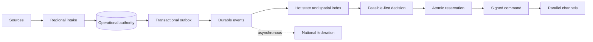

# Architecture and safety model

## Runtime shape

Each region owns an autonomous cell. Incident intake, live resource state, feasible-first allocation, authoritative reservation and dispatch occur locally. The national plane receives asynchronous projections and cannot block local dispatch.

The checked-in reference runtime deliberately uses built-in SQLite and in-process broker/provider adapters. The production ports target PostgreSQL/PostGIS, Kafka, etcd and HSM-backed providers without changing domain contracts.

## Non-negotiable invariants

1. An exclusive resource has at most one active assignment.
2. Every state-changing command carries an expected aggregate version.
3. Every successful resource hold increments a fencing epoch.
4. Devices reject lower resource or shard epochs, duplicates and expired commands.
5. A proposed plan is not dispatchable until all required provisional holds succeed.
6. A responder-accepted assignment cannot disappear because a service lease expires.
7. Hard safety constraints are never relaxed by degraded mode.
8. National-plane, shared-cache, live-routing and optimizer failures cannot remove deterministic regional fallback.
9. At-least-once transport is converted to idempotent effect at every consumer and provider boundary.
10. Manual overrides append evidence; they never rewrite decision history.

## Consistency classes

| Data | Consistency |
|---|---|
| Incident and resource commands | Strong per aggregate |
| Resource reservation | Serializable conditional transaction |
| Shard ownership and leader epoch | Linearizable quorum |
| Telemetry | Latest valid per-source sequence |
| Notifications | At least once with deduplication |
| Dashboards and analytics | Eventual with freshness |
| Audit | Append-only, hash-chained and immutable-exported |

## Regional failover rule

Loss of heartbeat is not proof of regional failure. A paired cell may take ownership only after positive fencing or expiry proved by the ownership quorum. State newer than the remote replication watermark becomes `UNKNOWN` and cannot be reused until device or EOC reconciliation.

